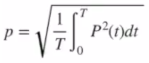
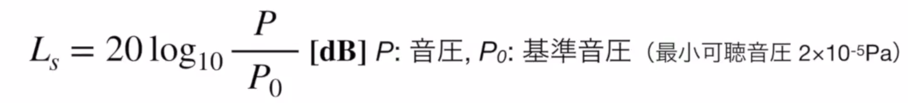

## 音の基本的性質  
音は音源から放射状に広がる  
音速cは媒質によって異なる  
  
音速 	```c[m/s] = λf```  
波長		```λ[m]```  
周波数	```f[Hz]```  
周期		```T[s] = 1/f```  
  
## 音の三要素  
### 高さ(pitch)  
人の可聴周波数範囲は20Hz~20kHz  
  
### 大きさ(volume)  
物理的特性から見た音の高さ  
音圧　大気圧を基準とした圧力の変化量  
  
**一定時間内の音圧**   
  
最小可聴音圧 20μPa = 2 * 10^-5 Pa  
最大可聴音圧 20Pa = 2 * 10^1 Pa  
  
**音圧レベル**  
  
### 音色(tone color)  
  
## 標本化と量子化  
### 標本化  
標本化周期  
標本をとる時間間隔  
  
標本化周波数  
１秒あたりに取る標本の数  
  
### 量子化  
量子化レベル  
量子化するときの段階の細かさ  
  
量子化ビット数  
データ点の量子化に必要な情報量  
  
標本化定理  
周波数　fmのディジタル信号を作るには  
2fm以上の標本化周波数が必要である  
  
**ナイキスト周波数**  
元のアナログ信号へ復元できる最高周波数  
  
### ディジタル誤差  
量子化誤差  
量子化された際に失われる情報  
  
丸め誤差  
値を計算などで小さくした際に失われる情報  
  
折り返し誤差  
ナイキスト周波数から溢れた成分を復元した際に  
元の周波数に侵食すること  
