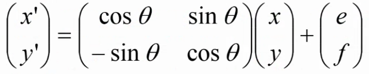

## 画像縮小  
### ダウンサンプリング  
元画像の領域から一画像を選択し画像を生成する  
  
横 1/L 倍、縦 1/M 倍に縮小する場合、  
元画像の`L * M`画素の領域の1画素を使用して再構成  
  
### 平均操作法  
横 1/L 倍、縦 1/M 倍に縮小する場合、  
元画像の`L * M`画素の領域の濃度平均を使用して再構成  
  
ダウンサンプリング法に比べてボヤっとした感じに仕上がる  
  
## 画像拡大  
### 零次ホールド法  
元画像の一画素を拡大画像の領域へ  
コピーすることで画像を再構成  
  
### 直線補完法  
新画素を隣接がその直線近似により決定  
右端、下端は計算対象となる一方がないので  
一つ左(もしくは上)の画素を用いて計算する  
  
## 幾何学返還(アフィン変更)  
拡大・縮小・回転・平行などの座標変換を行う事  
  
### 回転  
